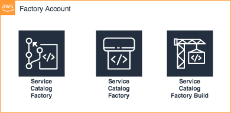

Getting it up and running
=========================

ServiceCatalog-Factory runs in your AWS Account.  In order for you to install it into your account you can use the 
aws-service-catalog-factory cli.  This is distributed via [PyPi](https://pypi.org/project/aws-service-catalog-factory/)

## What am I going to install?
ServiceCatalog-Factory is bootstrapped from your local machine.  You install a command line utility that will provision
the resources you need into your AWS Account.  Once you have completed the bootstrap you will have the following pipeline
in your account:


using the following services:




## Before you install
You should consider which account will be the home for your factory.  This account will contain the AWS CodePipelines
and will need to be accessible to any accounts you would like to share with.
 

## Installing the tool
This is a python cli built using Python 3.

It is good practice to install Python libraries in isolated environments.  You can create the a virtual environment using
the following command:

```bash
virtualenv --python=python3.7 venv
source venv/bin/activate
```

Once you have decided where to install the library you can install the package:
```bash
pip install aws-service-catalog-factory
```

This will install the library and all of the dependencies.


## Setting it up
The Factory will run in your account and needs some configuration.  You will need to stand up the factory and set up the 
configuration for it to run smoothly.


### Bootstrapping the Factory
There are two parts to bootstrapping the factory.  The first is concerned with setting the global configurations.  To do 
this we use AWS SSM Parameters.  To get setup you need to create a configuration file with a list of regions you want to 
use - for example config.yaml:

```yaml
regions: [
  'us-east-2',
  'us-east-1',
  'us-west-1',
  'us-west-2',
  'ap-south-1',
  'ap-northeast-2',
  'ap-southeast-1',
  'ap-southeast-2',
  'ap-northeast-1',
  'ca-central-1',
  'eu-central-1',
  'eu-west-1',
  'eu-west-2',
  'eu-west-3',
  'sa-east-1',
]
```
Configure aws cli using aws configure --profile *profilename* command.

Export variables:

For linux:
```
export AWS_PROFILE = profilename
export AWS_DEFAULT_REGION = region
```
For Windows:
```
set AWS_PROFILE = profilename
set AWS_DEFAULT_REGION = region
```
Note: the profilename should be the profile name used to configure aws cli, and region should be the aws region to bootstrap the factory.

Once you have this file you need to upload the config:
```bash
servicecatalog-factory upload-config config.yaml
```

If you make changes to this you will need to run upload-config and bootstrap commands again for the changes to occur.

Once that has completed you are ready to bring up the rest of the factory.


Use the cli tool to create the AWS CodeCommit repo and AWS CodePipeline resources that run the factory:
```bash
servicecatalog-factory bootstrap
```
This command will take a little while to run.  Once the command completes you can move onto the next step.


### Configuring your factory
You now need to clone the configuration repo and configure your factory:
```bash
git clone --config 'credential.helper=!aws codecommit credential-helper $@' --config 'credential.UseHttpPath=true' https://git-codecommit.eu-west-1.amazonaws.com/v1/repos/ServiceCatalogFactory
servicecatalog-factory seed simple ServiceCatalogFactory
cd ServiceCatalogFactory
git add .
git commit -am "initial add"
git push
```

For Windows users, use git clone command as:
```
git clone --config "credential.helper=!aws codecommit credential-helper $@" --config "credential.UseHttpPath=true" https://git-codecommit.eu-west-1.amazonaws.com/v1/repos/ServiceCatalogFactory
```

Please note ```git clone``` command above includes an AWS Region in it.  You may need to change this or you can use the
command the bootstrap command prints to the terminal upon completion for the correct command.

The seed command takes two parameters.  The first is the name of the example file you would like to use.  At the moment
here is only a _simple_ option.  You can also specify a simple github see using:

```bash
servicecatalog-factory seed simple-github ServiceCatalogFactory
``` 

More will be coming soon to show the flexibility of the Factory.

Once the pipeline has completed you have a working factory!  You will now need to configure at least one product.

### Setup your first product
The simple example file you used in the previous step declared an account-iam product that is stored in CodeCommit.
For the product pipeline to work you will need to create the git repo and add the product.template.yaml.

You can use the following snippet to do this easily:

```bash
aws codecommit create-repository --repository-name account-iam
git clone --config 'credential.helper=!aws codecommit credential-helper $@' --config 'credential.UseHttpPath=true' https://git-codecommit.eu-west-1.amazonaws.com/v1/repos/account-iam
cd account-iam
curl https://raw.githubusercontent.com/eamonnfaherty/cloudformation-templates/master/iam_admin_role/product.template.yaml -o product.template.yaml
git checkout -b v1
git add .
git commit -am "initial add"
git push --set-upstream origin v1
```
For Windows users, use git clone command as:
```
git clone --config "credential.helper=!aws codecommit credential-helper $@" --config "credential.UseHttpPath=true" https://git-codecommit.eu-west-1.amazonaws.com/v1/repos/account-iam
```

Please note, this clone command also contains an AWS Region that may need to change for this action to work.

Once you have pushed your product.template.yaml file you and the product pipeline has completed and you have a Service 
Catalog product ready to deploy in each region of your account.